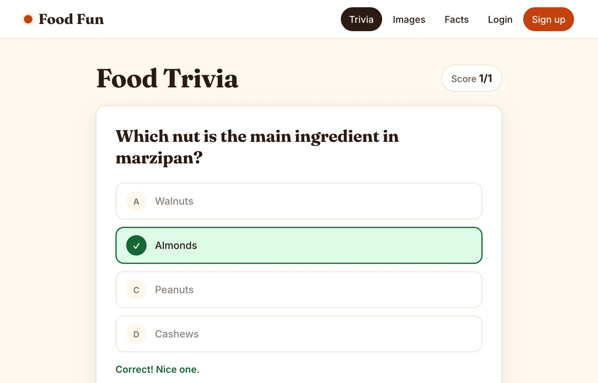
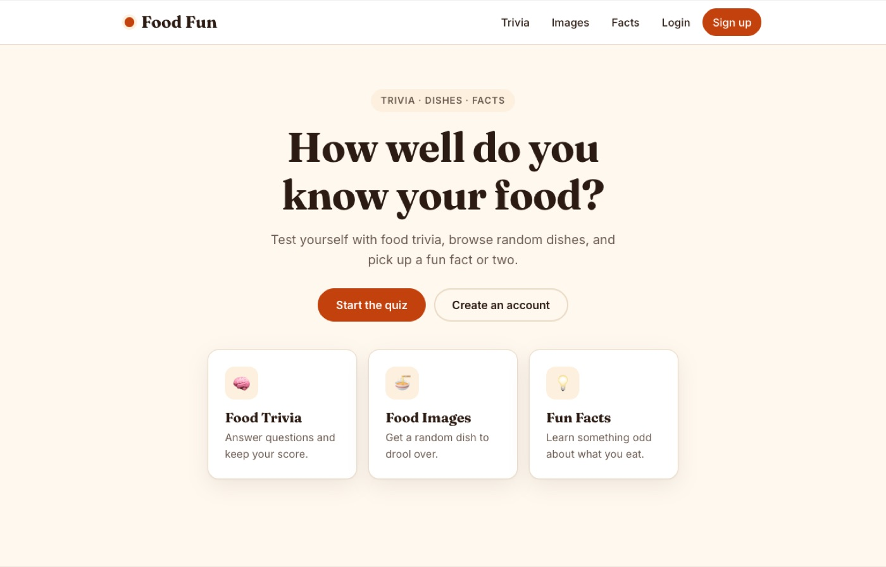

# Food Fun: Food Trivia & Facts

A full-stack web app for food trivia, random dishes and fun facts, with user accounts.
A React front end talks to an Express REST API backed by PostgreSQL, with JWT authentication.

**[Live demo](https://capstone-2-lemon-alpha.vercel.app)** · The API runs on a free tier, so the first request can take up to a minute to wake up.



## Features

- **Trivia quiz:** multiple-choice food questions served from the database, shuffled so every question is asked once before any repeats. Answers show correct/wrong feedback and a running score.
- **Food images:** a random dish photo and name from [TheMealDB](https://www.themealdb.com/api.php).
- **Fun facts:** a random food fact with an "Another fact" button.
- **Accounts:** sign up, log in and view a profile with your display name. Passwords are hashed with bcrypt and sessions use JWTs.
- **Quiz API:** signed-in users can add, update and delete questions through the REST API.
- **Responsive UI:** works on phones, supports light and dark mode, and has loading and error states.



## Tech stack

| Layer | Tools |
| --- | --- |
| Front end | React 18, React Router, Axios, plain CSS (custom properties) |
| Back end | Node.js, Express, `pg`, bcryptjs, jsonwebtoken, winston |
| Database | PostgreSQL |
| Hosting | Vercel (front end), Render (API), Neon (database) |

```
Browser ── React app (Vercel) ──► Express API (Render) ──► PostgreSQL (Neon)
                     └──► TheMealDB (dish photos)
```

## Run it locally

You need Node.js 20+ and a PostgreSQL database (a free [Neon](https://neon.tech) project works).

**1. Database.** Run `backend/schema.sql`, then `backend/seed-quizzes.sql` (33 questions) against your database.

**2. API**

```bash
cd backend
npm install
cp .env.example .env      # then fill in DATABASE_URL and JWT_SECRET
npm start                 # http://localhost:5000
```

Generate a secret with `node -e "console.log(require('crypto').randomBytes(48).toString('hex'))"`.

**3. Front end** (from the repository root)

```bash
npm install
echo "REACT_APP_API_URL=http://localhost:5000" > .env
npm start                 # http://localhost:3000
```

## API reference

Protected routes need an `Authorization: Bearer <token>` header from `/auth/login`.

| Method | Path | Auth | Purpose |
| --- | --- | --- | --- |
| POST | `/auth/register` | none | Create an account (`username`, `email`, `password`) |
| POST | `/auth/login` | none | Log in and receive a JWT |
| GET | `/auth/profile` | required | Current user's profile |
| PUT | `/auth/profile` | required | Update display name (`name`) |
| GET | `/api/quizzes/quizzes` | none | List all trivia questions |
| POST | `/api/quizzes/quizzes` | required | Add a question (`question`, `options[]`, `correct_answer`, `category`) |
| PUT | `/api/quizzes/quizzes/:id` | required | Update a question |
| DELETE | `/api/quizzes/quizzes/:id` | required | Delete a question |

## What I learned

- **Linux is case-sensitive.** A file named `image.js` imported as `Image` worked on my Mac and broke the Vercel build. I now check imports against git's file list, not my disk.
- **Third-party APIs disappear.** The two APIs I first used for trivia and images shut down. I moved trivia into my own database and seed file, so the core feature no longer depends on someone else's service, and swapped the image source for TheMealDB.
- **Keep secrets out of git.** I committed a `.env` early on. I moved to a new database and secrets, untracked the file and added `.env.example`.
- **Free tiers sleep.** I documented the cold start and added loading and retry states so the app doesn't look broken while the API wakes up.

## Roadmap

- An admin role and a UI for managing questions (today, any signed-in user can edit questions through the API).
- Save quiz scores per user and show them on the profile.
- Automated tests for the API and the quiz component.
- Remove the unused legacy `/api/users` routes.
